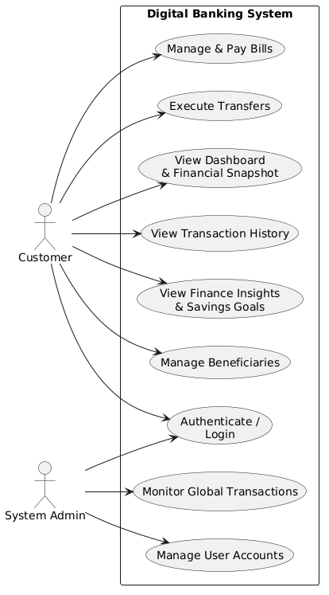
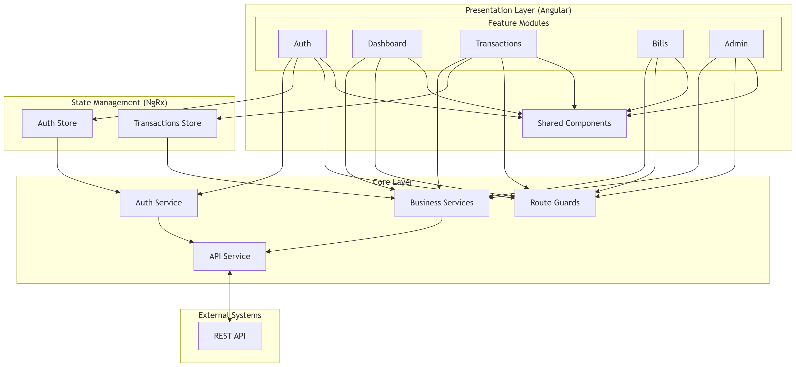

## Use Case Diagram

The use case diagram illustrates the primary interactions between the system's actors and the Digital Banking System. Customers can access core financial features such as viewing account information, transferring funds, managing beneficiaries, paying bills, tracking savings goals, and reviewing transaction history. System administrators are responsible for managing user accounts and monitoring system-wide transactions. Authentication is required before users can access protected functionality.

---

## Component Architecture Diagram

The component architecture diagram presents the high-level structure of the frontend application and its interaction with backend services. The Presentation Layer contains Angular feature modules responsible for user-facing functionality. Application state is managed using NgRx stores, providing centralized and predictable state management. The Core Layer contains reusable services, route guards, and API communication logic. These components communicate with the backend through REST APIs, enabling secure access to business logic and persistent data storage.

